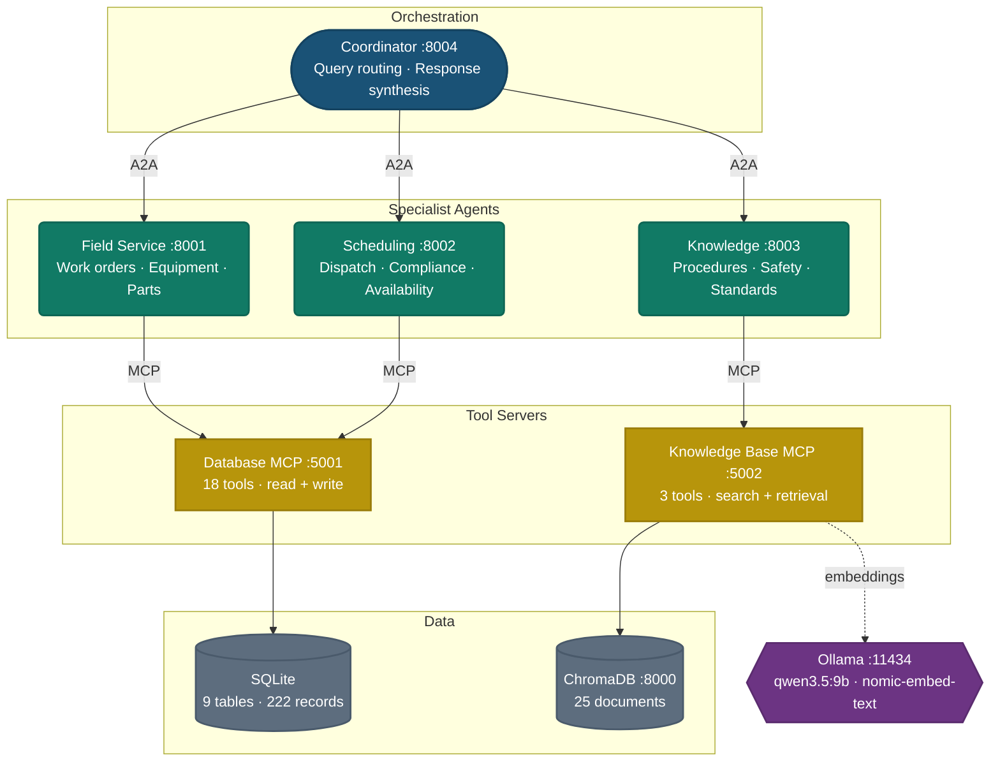

# microfactory

Multi-agent field service operations platform for HVAC, electrical, plumbing, and refrigeration services across Brisbane metro (QLD, Australia).

## Overview

microfactory coordinates four specialised AI agents to handle the full scope of field service operations. A central coordinator routes incoming queries to the right specialist, whether that involves looking up a work order, scheduling a technician, or retrieving a safety procedure, and synthesises responses when a query spans multiple domains.

The system is built with Google ADK for agent logic, the A2A protocol for inter-agent communication, MCP tool servers for structured data access, and a RAG knowledge base backed by ChromaDB. All inference runs locally through Ollama, with no external API calls required.

This project demonstrates the AI Factory approach: autonomous agentic teams operating over real business domains, with local data ownership and safety-critical compliance built into the workflow.

## Architecture



> **7 containerised services** via Docker Compose · All inference runs locally through **Ollama** via LiteLLM · Agents communicate over **A2A protocol** · Tools accessed via **MCP** (StreamableHTTP)

## Agents

| Agent         | Port | Role                                                                 | MCP Tools                     |
| ------------- | ---- | -------------------------------------------------------------------- | ----------------------------- |
| Coordinator   | 8004 | Routes queries to specialists, synthesises multi-agent responses     | None (delegates via A2A)      |
| Field Service | 8001 | Work orders, equipment, parts inventory, customer context            | 6 read + 3 write tools        |
| Scheduling    | 8002 | Technician availability, dispatch, certification compliance          | 9 scheduling/compliance tools |
| Knowledge     | 8003 | Troubleshooting procedures, safety protocols, maintenance checklists | 3 search/retrieval tools      |

All agents run qwen3.5:9b via LiteLLM and enforce strict domain boundaries.

## Tech Stack

| Layer               | Technology                            |
| ------------------- | ------------------------------------- |
| Language            | Python 3.13                           |
| Package manager     | uv (workspace)                        |
| LLM runtime         | Ollama (qwen3.5:9b, nomic-embed-text) |
| Agent framework     | Google ADK                            |
| Agent communication | A2A protocol (a2a-sdk)                |
| LLM routing         | LiteLLM                               |
| Tool protocol       | MCP via FastMCP                       |
| Vector database     | ChromaDB                              |
| Relational database | SQLite                                |
| Containerisation    | Docker Compose (7 services)           |

## Project Structure

```
microfactory/
├── agents/
│   ├── coordinator/       # Query routing, multi-agent orchestration
│   ├── field_service/     # Work orders, equipment, parts, customers
│   ├── scheduling/        # Technician dispatch, certification compliance
│   └── knowledge/         # Technical knowledge RAG
├── tools/
│   ├── database/          # FastMCP server -> SQLite (18 tools)
│   └── knowledge_base/    # FastMCP server -> ChromaDB (3 tools)
├── scripts/
│   ├── create_database.py # Seed SQLite from CSVs
│   └── create_vectors.py  # Ingest knowledge base into ChromaDB
├── data/
│   ├── bronze/            # Raw CSVs + knowledge base markdown
│   └── silver/            # SQLite DB + ChromaDB vector store
├── docs/                  # Capability matrix, data schema, design specs
└── docker-compose.yml     # 7 containerised services
```

## Data

9 tables and 222 seed records in SQLite covering customers, technicians, equipment, work orders, parts inventory, schedules, certifications, and job notes across Brisbane metro service areas. 25 knowledge base documents in ChromaDB spanning troubleshooting procedures, safety protocols, maintenance checklists, SOPs, and Australian Standards references.

See [data/README.md](data/README.md) for the full schema reference and knowledge base document list.

## Prerequisites

- [uv](https://docs.astral.sh/uv/getting-started/installation/): `curl -LsSf https://astral.sh/uv/install.sh | sh`
- [Ollama](https://ollama.com/download): `curl -fsSL https://ollama.com/install.sh | sh`
- [Docker](https://docs.docker.com/get-docker/)

## Setup

```bash
# Clone and enter the project
git clone https://github.com/sarathi/microfactory.git
cd microfactory

# Configure environment
cp .env.example .env

# Pull models
ollama pull qwen3.5:9b
ollama pull nomic-embed-text

# Install dependencies
uv sync --all-packages

# Start Ollama
ollama serve

# Seed the database and create vector embeddings
uv run python scripts/create_database.py
uv run python scripts/create_vectors.py

# Start all services
docker compose up
```

---

Thank you for visiting and checking out microfactory!
